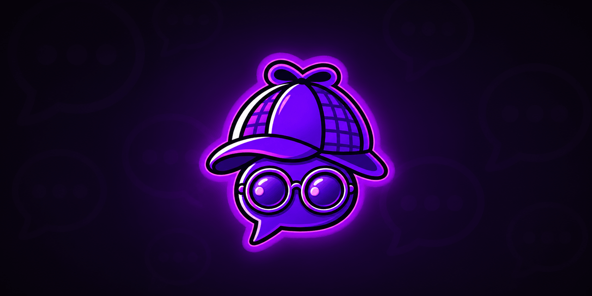
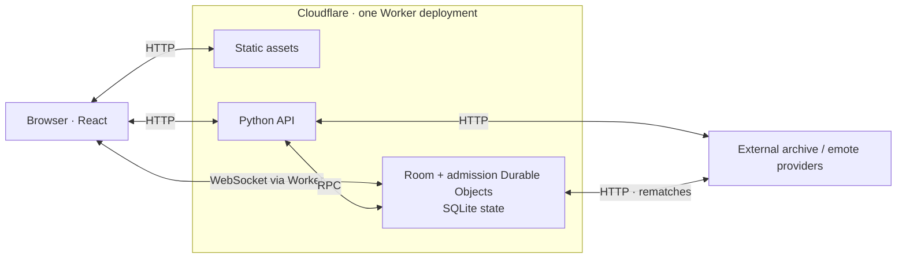

# Know The Chat

Know The Chat is a Twitch chat guessing game: read a real archived message and guess which of three chatters said it. Play solo or invite friends to a private, timed match.

**[Play at knowthechat.com](https://knowthechat.com)**

## How to play

- **Solo:** choose a channel, archive period, and chatter pool. Build a streak, track your accuracy, and unlock celebrations.
- **With friends:** share a private room with 2–8 players. Everyone gets the same clue and choices; correct, quick answers earn more points. The host advances after each reveal, and rematches fetch fresh clues.
- **Make it yours:** keyboard controls, optional music and sound effects, visual-effects settings, and reduced-motion support.

No Twitch login is required. Games use public archives, so available channels and periods depend on those providers.

## Technical highlights

- **React + TypeScript frontend and Python/FastAPI API**, served from one Cloudflare Worker and one origin.
- **Server-authoritative multiplayer** with a SQLite-backed Durable Object per room, server deadlines, and answers hidden until reveal.
- **Hibernating WebSocket updates**, automatic reconnection, tab session restoration, and HTTP fallback.
- **Bounded archive processing** to turn large public chat logs into playable clues within Worker resource limits.
- **Automated validation** across frontend behavior, Python rules/runtime adapters, types, builds, and Worker deployment dry runs.

## Architecture

Read the **[architecture guide](docs/architecture.md)** for the system diagram, multiplayer round sequence, room lifecycle, and links to the implementation.

## Explore the repository

- [Development guide](docs/development.md): installation, local servers, validation, smoke tests, and the streak/audio playground.
- [Cloudflare operations](docs/cloudflare.md): hosting configuration, observability, and rollback.
- [Contributing](CONTRIBUTING.md) and [roadmap](ROADMAP.md): how to help and ideas for future work.
- [Audio credits](frontend/public/audio/CREDITS.md): bundled music and sound sources/licenses.

This is an unofficial community project, unaffiliated with Twitch, Amazon, featured streamers, or its data providers. See the [privacy notice](PRIVACY.md), [third-party notices](THIRD_PARTY_NOTICES.md), [security policy](SECURITY.md), and [code of conduct](CODE_OF_CONDUCT.md).

## License

Project code is available under the [MIT License](LICENSE); bundled audio retains the licenses listed in its credits.
