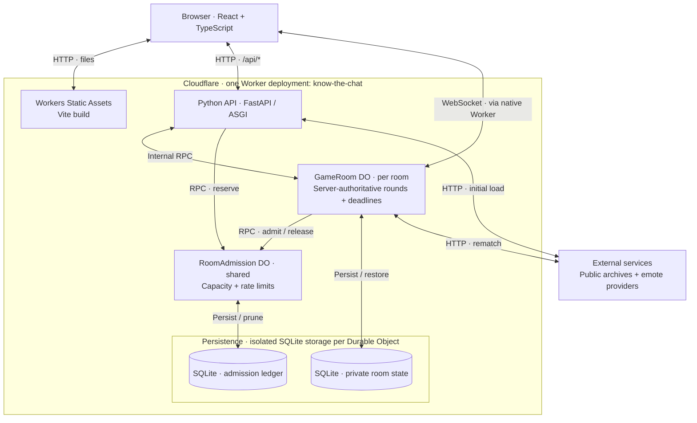
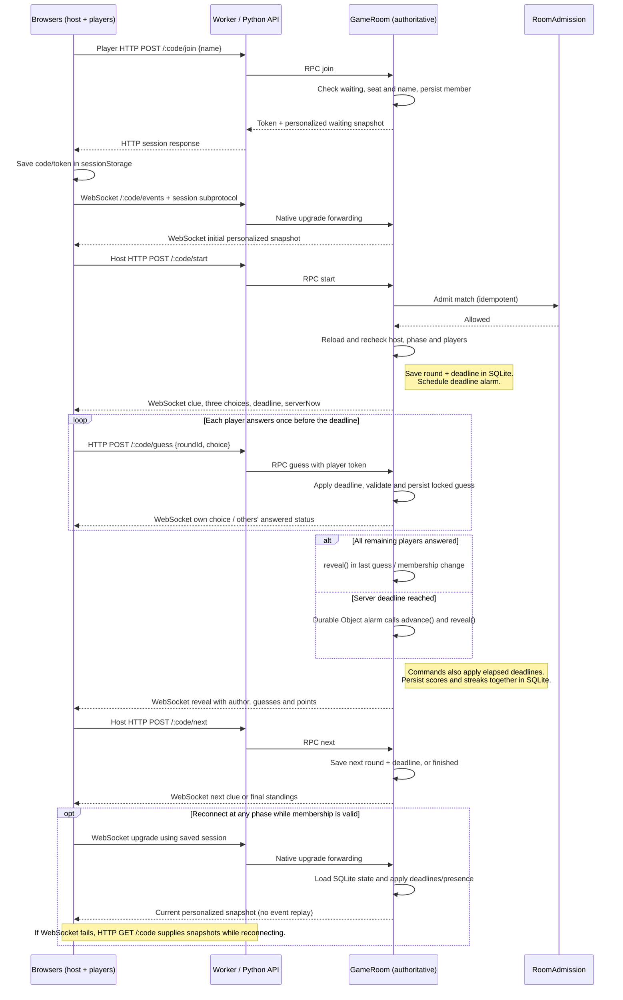
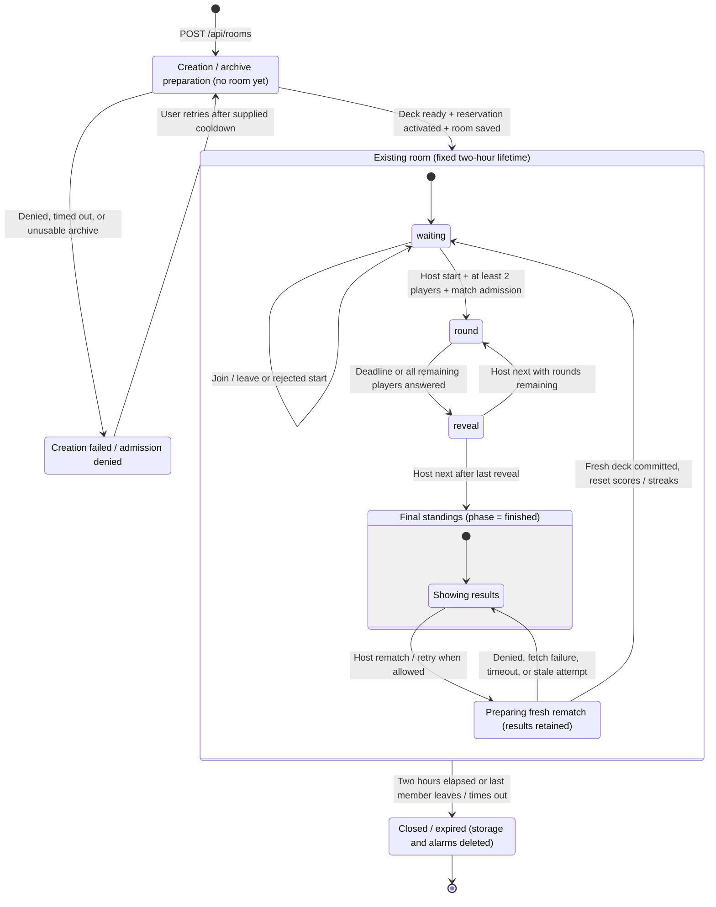

# Architecture

## Overview

Know The Chat turns public Twitch chat archives into a three-choice guessing game. In solo mode, the browser builds and runs the game from an API response. In multiplayer, friends share a private room and the server controls the clues, deadlines, locked answers, scores, and reveals.

The application has one Cloudflare Worker deployment, `know-the-chat`. Workers Static Assets serves the React frontend; Python handles the same-origin API. One `GameRoom` Durable Object owns each multiplayer room, and one shared `RoomAdmission` Durable Object coordinates room capacity and new-match limits. Both persist in their own SQLite storage.

Use the [source map](#source-map) to navigate the implementation, [Development](development.md) for local setup, and [Cloudflare operations](cloudflare.md) for hosting configuration. The Mermaid blocks below are the canonical architecture diagrams; update them alongside architectural changes.

## System architecture

WebSockets push room snapshots and exchange heartbeats; **players submit commands over HTTP**, including guesses. SQLite belongs to the Durable Objects. There is no separate database service, D1, KV, queue, or second API Worker configured. Optional browser profile/image requests are described below and omitted from this game-system diagram for readability.

Sources: [production configuration](../backend/wrangler.jsonc), [Worker entrypoint](../backend/src/main.py), [room runtime](../backend/src/runtime/rooms.py), and [admission runtime](../backend/src/runtime/admission.py).

## Request and data flow

### Frontend and HTTP boundary

Workers Static Assets serves the Vite output and SPA navigation fallback. Only `/api/*` runs Python first. The [entrypoint](../backend/src/main.py) forwards room event upgrades directly to the Durable Object; other API requests go through Cloudflare's ASGI adapter into [FastAPI](../backend/src/fastapi_app.py), without a Uvicorn server process.

FastAPI/Pydantic validates settings and commands. Middleware bounds archive/room POST bodies to 16 KiB, and dynamic responses use `Cache-Control: no-store`. Unknown API paths return API errors rather than the SPA. Room HTTP requests check the host against a supplied browser `Origin`; WebSocket upgrades check the full supplied origin.

| Public route                                             | Responsibility                                                                          |
| -------------------------------------------------------- | --------------------------------------------------------------------------------------- |
| `POST /api/public-archive`                               | Return ranked chatters and candidate quotes for solo play.                              |
| `POST /api/rooms`                                        | Admit preparation, fetch a private deck, initialize a room, and issue the host session. |
| `POST /api/rooms/:code/join`                             | Add a player to a `waiting` room and issue their session.                               |
| `GET /api/rooms/:code`                                   | Return the authenticated player's snapshot; also supplies HTTP fallback/presence.       |
| `POST /api/rooms/:code/{start,guess,next,rematch,leave}` | Apply a validated action; `guess` includes `roundId` and `choice`.                      |
| `GET /api/rooms/:code/events`                            | Upgrade to a hibernating WebSocket for that player's updates.                           |

Route sources: [room routes](../backend/src/room_routes.py), [request models](../backend/src/room_models.py), and [native event forwarding](../backend/src/runtime/room_events.py).

### Public archive pipeline

[PublicArchiveService](../backend/src/services/public_archive.py) serves solo loading, room creation, and rematches. Its [runtime composition](../backend/src/runtime/archive.py) wires replaceable providers through small `Protocol` interfaces and constructor injection.

1. Discover historical log instances through Zonian, accept trusted origins, and merge available dates. Select active dates across chronological buckets using message-count metadata, then fetch bounded windows within those dates.
2. Parse and filter bots, system events, commands, low-quality messages, and exact/near duplicates. Rank recognizable chatters using participation, activity across days/months, and badges.
3. If the initial historical sample has too few playable quotes, attempt one bounded expansion pass. Keep the initial sample if expansion fails. Recent-message fallback is allowed only when discovery confirms the historical archive is missing, for a rolling period or the current year. Historical and recent sources are never mixed; a historical discovery failure returns an error instead of silently changing the source.
4. Merge optional emote catalogs and select representative high-quality quotes per chatter. The solo response includes authors. Multiplayer converts it into a private deck and exposes only the current clue without its author until reveal.

| External service                                    | Caller and purpose                                                           |
| --------------------------------------------------- | ---------------------------------------------------------------------------- |
| Zonian and trusted public log instances             | Python discovers and samples historical archives.                            |
| Robotty, Zneix, and Zonian recent-message endpoints | Python fetches recent chat when fallback is allowed.                         |
| 7TV, BetterTTV, FrankerFaceZ                        | Python loads emote catalogs; solo also attempts browser-side 7TV enrichment. |
| IVR and image/emote CDNs, including Twitch's CDN    | The browser loads optional streamer profiles and renders remote images.      |

URLs and parsers live in [archives.py](../backend/src/providers/archives.py) and [emotes.py](../backend/src/providers/emotes.py). Browser requests live in [App.tsx](../frontend/src/App.tsx), [useStreamerProfile.ts](../frontend/src/useStreamerProfile.ts), and [PartyGame.tsx](../frontend/src/PartyGame.tsx). No Twitch login or live chat connection is required. Separately, [index.html](../frontend/index.html) loads Google AdSense, outside the game-state flow; see the [privacy notice](../PRIVACY.md).

## Multiplayer architecture

### Authority and persistence

`GAME_ROOMS.getByName(code)` addresses one Python `GameRoom` per six-character code. Its `room_state` SQLite table holds one JSON row: members, host, token hashes, private rounds, guesses, pending points, scores/streaks, deadline, expiry, revision, original archive settings, and recent quote hashes. Commands, connections, and alarms reload that state; the Python instance is not the authority. Initial start requires 2–8 players. Matches have 5/10/20 rounds and 15/20/30-second deadlines.

Creation fetches archives **before** initialization, then activates its reservation and stores the deck. Only selected rounds and up to 2,000 recent quote-text hashes are retained, not the downloaded archive. Initial and replacement payloads are checked against a 256,000-byte limit. Bounded history means sufficiently old clues can eventually recur.

The deterministic [Room rules](../backend/src/domain/rooms.py) lock one guess per player per round. Correct guesses calculate `1000 + floor(500 × remaining_fraction)` using server receipt time; wrong or missing guesses earn zero. Points remain private until `reveal()`, which updates everyone's score and streak together. Before reveal, a personalized snapshot includes the current clue, the same three choices, the player's own choice, and others' answered status. It omits the author, others' choices, pending points, future deck, token hashes, and quote history.

The host starts and advances play, including a separate `next` after the final reveal to enter `finished`. Departure or inactivity removal transfers hosting to the first remaining member. Disconnecting alone does not immediately remove a member or elect a new host. New players can join only in `waiting`; successful rematches return there and preserve memberships.

### Admission coordination

`ROOM_ADMISSION.getByName("lobbies")` owns a separate SQLite ledger. Configurable allowances cover open rooms/preparations, archive preparations, new matches, and room creation per network key. Waiting lobbies and final standings still occupy capacity. Defaults and configuration live in the [operations guide](cloudflare.md#multiplayer-admission-limits).

Creation reserves capacity before archive I/O. The first start admits its match; rematch preparation admits both the next match and a fresh fetch, retaining the room slot. Match admission is idempotent for a reservation/match number: a failed rematch retry uses another preparation allowance but reuses that pending match's admission. Starting the prepared rematch does not charge it again. Ordinary round gameplay and heartbeat traffic remain local to each room.

Short leases and alarm-driven pruning recover abandoned work. Failed admitted preparations still count; rejected preparations do not. A SHA-256 network key exists only in the 60-second creation ledger, while daily records retain identifiers and timestamps. The key is pseudonymous; raw IP addresses are not persisted there. See [admission settings and retention](cloudflare.md#multiplayer-admission-limits) for configuration and legacy-room handling.

## Multiplayer round flow

This traces [PartyGame](../frontend/src/PartyGame.tsx), [command dispatch](../backend/src/services/room_commands.py), [Room](../backend/src/domain/rooms.py), and [GameRoom](../backend/src/runtime/rooms.py). The host has already created a `waiting` room with a prepared deck. “Browsers” groups the host and guests; each receives its own snapshot. All `/:code` paths below start with `/api/rooms`. WebSocket upgrades bypass FastAPI, and routine HTTP responses are abbreviated.

The answer loop illustrates guesses that leave the round open. The final guess can score, persist, and broadcast `reveal` in that same command; it needs no separate scoring request. The host submits guesses through the same HTTP path. An expired or removed session cannot reconnect as that member.

## Room lifecycle

The stored [`Phase`](../backend/src/room_types.py) values are exactly `waiting`, `round`, `reveal`, and `finished`. Preparation/error nodes describe operations and UI states. Rematch loading remains `phase = "finished"`; persisted `rematch_attempt` and `rematch_until` fields guard concurrent preparation without adding a phase.

There is no automatic advance from reveal, and rematching does not extend expiry. Failed initial preparation releases its reservation before initialization begins; ambiguous initialization resolves through its lease/room expiry. Rematches persist a two-minute attempt lease and use a 90-second timeout for admission/fetching, then reload and check host, phase, attempt, and expiry before replacing state. Concurrent departures or deletion cannot be overwritten by the old fetch result. Failure keeps scores and the deck intact; a crashed attempt can be retried after its lease expires.

Sources: [creation/deck preparation](../backend/src/services/rooms.py), [rematch/cleanup runtime](../backend/src/runtime/rooms.py), and [fresh-rematch tests](../backend/tests/test_fresh_rematches.py).

## Reliability and reconnection

### Transport and session restoration

The browser saves `{code, token}` in tab-scoped `sessionStorage`. Reloading restores membership while it remains valid; there is no account or cross-device recovery. HTTP uses `Authorization: Bearer`; WebSockets offer `knowthechat.v1` and `session.<token>` and negotiate only the former. Tokens never enter invite links or URLs. The room stores token hashes and attaches only the player ID to sockets, with limits of two sockets per player and sixteen per room.

[connectRoom](../frontend/src/roomConnection.ts) considers a socket healthy after its first valid snapshot, with an eight-second initial timeout. It sends `ping` every 25 seconds and allows ten seconds for `pong`. Cloudflare answers through `setWebSocketAutoResponse` without waking Python. `acceptWebSocket`, attachments, and heartbeat timestamps support hibernation recovery; see [Cloudflare's hibernation guide](https://developers.cloudflare.com/durable-objects/best-practices/websockets/).

Failures trigger exponential reconnect delays capped at 30 seconds and HTTP fallback. Polling normally runs every 1.5 seconds, or five seconds in `finished`, backing off to at most 15 seconds on failures. A healthy socket stops polling. Hidden tabs/page suspension close sockets and stop polling; returning reconnects, subject to membership expiry.

Both transports validate snapshots through [roomProtocol.ts](../frontend/src/roomProtocol.ts). The persisted increasing revision lets [PartyGame](../frontend/src/PartyGame.tsx) ignore older snapshots, including delayed HTTP responses after a push. Reconnection retrieves current state instead of replaying events. Invalid membership/missing rooms clear the saved session; transient failures retain the view and reconnect. User commands are not automatically replayed after a network error.

### Deadlines, cleanup, and failures

The countdown estimates server time from `serverNow` and `deadline`; the authoritative check uses the room clock. One alarm targets the earliest round deadline, member inactivity timeout, or room expiry. Commands also apply expired deadlines before accepting a guess, and reveal is idempotent. A round can end with every browser disconnected.

Members expire after 15 minutes without presence. Before pruning, the runtime incorporates automatic heartbeat timestamps; HTTP presence writes are throttled to 15 seconds. Empty or two-hour-old rooms call `deleteAll()` to clear application storage and alarms, close sockets, and attempt to release capacity. Failed release cannot retain capacity beyond reservation expiry. Unknown room reads create no room tables or alarms. These rules concern application state, not Cloudflare backup retention.

[Outbound HTTP](../backend/src/runtime/http.py) streams into a size-bounded buffer before JSON parsing, with timeouts. Historical loading uses trusted hosts and one archive-body fetch at a time: up to 6,000 retained messages initially, plus 4,000 in one optional expansion. Emote failures are isolated. Create/rematch clients wait up to 110 seconds for preparation responses; other room requests time out after 12 seconds. Supplied admission retry delays disable only the affected action until the user can retry.

The room persists and broadcasts each changed revision before yielding to later commands. Start/rematch reload after external I/O and revalidate before committing. Tests cover [deadline recovery](../backend/tests/test_room_runtime.py), [WebSockets](../backend/tests/test_room_websockets.py), [admission](../backend/tests/test_admission_runtime.py), and [browser reconnection](../frontend/src/PartyGame.live.test.tsx). See [local smoke tests](development.md#smoke-tests) for real runtime integration.

## Deployment model

[`backend/wrangler.jsonc`](../backend/wrangler.jsonc) declares `know-the-chat`, Custom Domains `knowthechat.com` and `www.knowthechat.com`, `ASSETS`, and both SQLite-backed Durable Object classes/migrations. `frontend/dist` supplies assets with SPA fallback and `run_worker_first` limited to `/api/*`. The compatibility date is `2026-08-22` with `python_workers`. [`frontend/wrangler.jsonc`](../frontend/wrangler.jsonc) supports Vite development/builds; it is not the deploy target. See Cloudflare's [selective Worker routing](https://developers.cloudflare.com/workers/static-assets/routing/advanced/) and [Python FastAPI integration](https://developers.cloudflare.com/workers/languages/python/packages/fastapi/).

Cloudflare edge rate limiting is configured separately from the Worker's multiplayer admission coordinator. See [edge rate limiting](cloudflare.md#edge-rate-limiting) for hosting notes.

[`npm run check`](../package.json) validates both applications, builds the frontend, and dry-runs the Worker deployment. [GitHub Actions](../.github/workflows/quality.yml) runs it on pull requests/manual dispatch. The [operations guide](cloudflare.md#deployment-and-rollback) records Workers Builds deployment from `main`; that account-side connection and branch configuration cannot be established from source alone.

## Key design decisions

| Choice                                        | Benefit and tradeoff                                                                                                                              |
| --------------------------------------------- | ------------------------------------------------------------------------------------------------------------------------------------------------- |
| One origin and Worker deployment              | Frontend/API ship together with relative URLs; static requests bypass Python.                                                                     |
| Browser-owned solo, server-owned multiplayer  | Solo stays simple; multiplayer enforces consistent scoring. Public source material makes this casual play, not an anti-cheat guarantee.           |
| One SQLite-backed object per room             | One authority for membership, deadlines, and scores. Full personalized snapshots suit eight players; audience-scale play needs measured redesign. |
| HTTP commands + hibernating WebSocket updates | Reuse validated command routes and allow idle rooms to hibernate. Two transports require shared validation and revision ordering.                 |
| Separate admission ledger                     | Bound preparation/new matches across rooms while normal rounds continue independently. New actions fail closed if coordination is unavailable.    |
| Bounded sampling and optional providers       | Keep public archives practical within Worker resource limits, trading exhaustive coverage for bounded work.                                       |
| Commit fresh rematches after preparation      | Preserve results on failure; history and room lifetime remain bounded.                                                                            |
| Pure rules and injected protocols             | Test domain behavior without Cloudflare/live HTTP; smoke tests cover runtime integration.                                                         |

### Source map

| Start here                                                                                                                                                       | What it owns                                                                                                                              |
| ---------------------------------------------------------------------------------------------------------------------------------------------------------------- | ----------------------------------------------------------------------------------------------------------------------------------------- |
| [`Site.tsx`](../frontend/src/Site.tsx), [`App.tsx`](../frontend/src/App.tsx)                                                                                     | Page/mode selection, solo setup/game/results, seen-message history and preferences.                                                       |
| [`PartyGame.tsx`](../frontend/src/PartyGame.tsx), [`roomConnection.ts`](../frontend/src/roomConnection.ts), [`roomProtocol.ts`](../frontend/src/roomProtocol.ts) | Multiplayer UI/actions, session restoration, transport, snapshot validation.                                                              |
| [`audio.ts`](../frontend/src/audio.ts), [`music.ts`](../frontend/src/music.ts), [`StreakEffects.tsx`](../frontend/src/StreakEffects.tsx)                         | Local audio/visual feedback; playground in `frontend/playground/`.                                                                        |
| [`main.py`](../backend/src/main.py), [`fastapi_app.py`](../backend/src/fastapi_app.py), [`room_routes.py`](../backend/src/room_routes.py)                        | Worker entry, bounded HTTP boundary, validation/routing.                                                                                  |
| [`backend/src/services/`](../backend/src/services/)                                                                                                              | Archive orchestration, private-deck preparation, command dispatch.                                                                        |
| [`backend/src/domain/`](../backend/src/domain/)                                                                                                                  | Parsing/filtering/ranking/sampling, game rules, admission policy types. `scoring.py` rates quotes; multiplayer points live in `rooms.py`. |
| [`backend/src/providers/`](../backend/src/providers/)                                                                                                            | Provider interfaces, URLs, response parsing, emote catalogs.                                                                              |
| [`backend/src/runtime/`](../backend/src/runtime/)                                                                                                                | Cloudflare HTTP/bindings, SQLite rooms/admission, WebSockets, alarms.                                                                     |
| [`backend/tests/`](../backend/tests/), frontend `*.test.ts(x)`, [`scripts/`](../scripts/)                                                                        | Domain/runtime and browser tests, local smoke checks, type/audio tooling.                                                                 |

When changing a boundary, trace its route, service, rule, runtime adapter, and frontend consumer before updating the Mermaid block. Keep the [README diagram](../README.md#architecture) as a small overview of this document.
